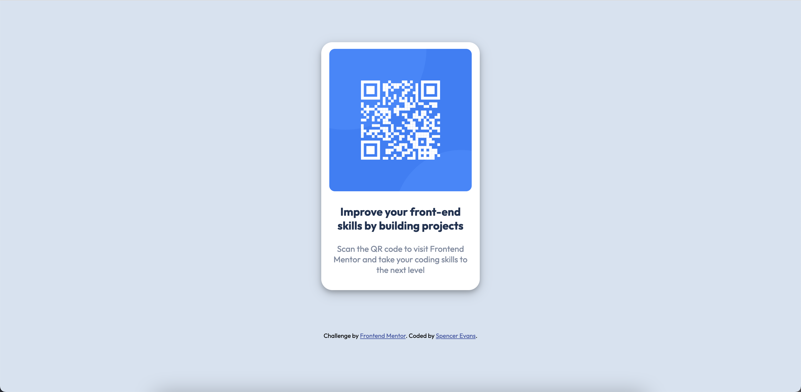

# Frontend Mentor - QR code component solution

This is a solution to the [QR code component challenge on Frontend Mentor](https://www.frontendmentor.io/challenges/qr-code-component-iux_sIO_H). Frontend Mentor challenges help you improve your coding skills by building realistic projects. 

## Table of contents

- [Overview](#overview)
  - [Screenshot](#screenshot)
  - [Links](#links)
- [My process](#my-process)
  - [Built with](#built-with)
  - [What I learned](#what-i-learned)
  - [Continued development](#continued-development)
  - [Useful resources](#useful-resources)
- [Author](#author)

**Note: Delete this note and update the table of contents based on what sections you keep.**

## Overview

### Screenshot

### Links

- Solution URL: [GitHub Files](https://github.com/spenceraevans/frontendmentor-qrcodecomponent)
- Live Site URL: [Live Site](https://spenceraevans.github.io/frontendmentor-qrcodecomponent/)

### My Process

### Built with

- HTML5
- CSS 

### What I learned

I really used this challenge to help me continue to practice my HTML and CSS skills. I found this challenge to be relativley simple and was able to complete it in a short time. My only struggle was getting the media queries to work so I could make the page responsive to different size screens which I was able to get eventually.

### Continued development

Understanding positioning is something I am still working on. I was able to figure this one out pretty easily but I know future projects may require more complicated positionings. Also media queries are still pretty new to me so learning to adapt code to smaller or bigger screens I know is important. 

### Useful resources

- [W3 Schools](https://www.w3schools.com/cssref/css3_pr_mediaquery.asp) - I used this W3 schools resource to help me with the media queries and I was able to understand what I needed to do pretty well 

## Author

- Frontend Mentor - [@spenceraevans](https://www.frontendmentor.io/profile/spenceraevans)
- Twitter - [@spenceraevans](https://twitter.com/spenceraevans)
- GitHub - [@spenceraevans](https://github.com/spenceraevans)

